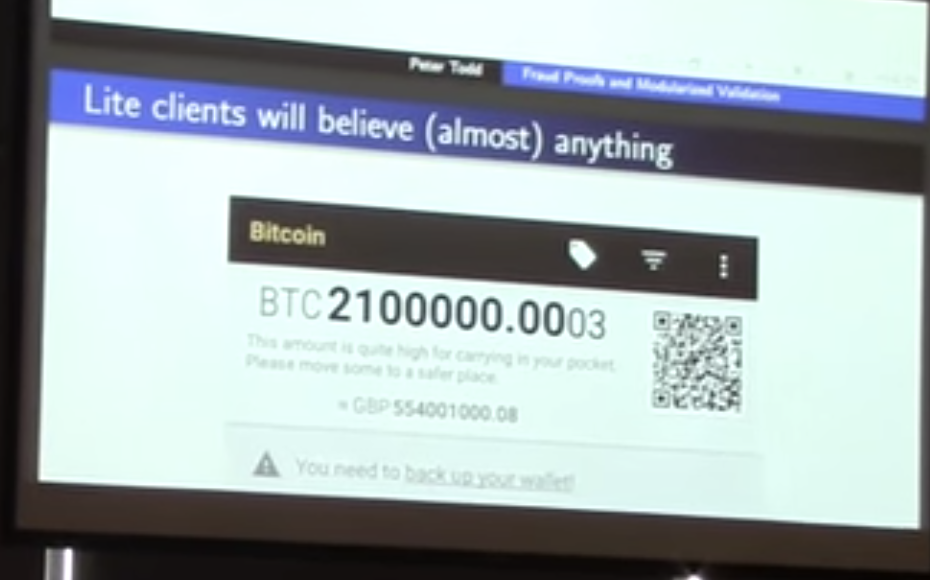
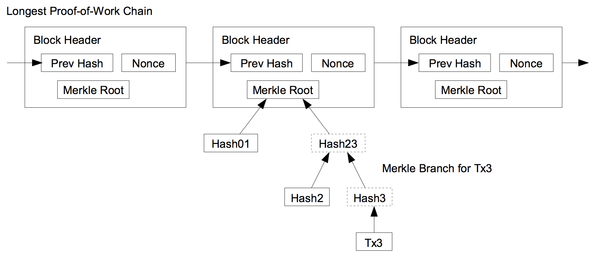
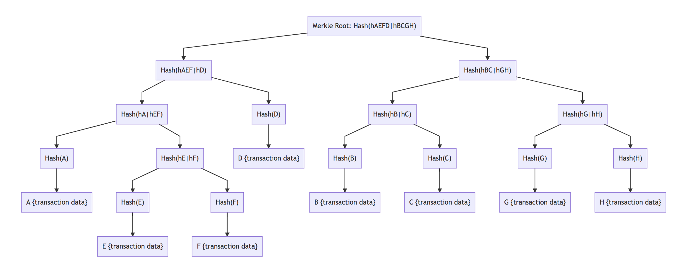

# Fraud Proofs - easier said than done?

## Background
The Bitcoin blockchain is, as of June 2018, approximately 173 Gigabytes in size [1]. This makes it nearly impossible for everyone to run a full Bitcoin node. Lightweight/Simplified Payment Verification (SPV) clients will have to be used by users since not everyone can run full nodes due to the computational power and cost needed to run a full Bitcoin node. 

Courtesy:MIT Bitcoin Expo 2016 Day 1

SPV clients will believe everything miners or nodes tell them, as evidenced by Peter Todd in the screenshot above showing an Android client showing millions of bitcoin. The wallet was sent a transaction 2.1 million BTC outputs [17] 

## Contents
- [Fraud Proofs - easier said than done?](#Fraud-Proofs---easier-said-than-done?)
   - [Background](#background)
   - [What are fraud proofs](#what-are-fraud-proofs)
   - [Security and privacy issues with SPV clients](#security-and-privacy-issues-with-spv-clients)
   - [Examples of SPV implementations](#examples-of-spv-implementations)
   - [Suggested fraud proof improvements](#suggested-fraud-proof-improvements)
   - [Conclusions, Observations, Recommendations](#conclusions-observations-recommendations)
   - [References](#references)

In the original Bitcoin whitepaper, Satoshi recognised this and introduced the concept of a Simplified Payment Verification (SPV) [2], in which he describes a technique that allows verification of payments using a lightweight client that doesn't need to download the entire Bitcoin blockchain, but rather by only downloading block headers with the longest proof-of-work chain , which are achieved by obtaining the Merkle branch linking a transaction to a block[3]. The existence of [Merkle root](#blob/master/merkle-trees-and-spv-1/PITCHME.md#merkle-trees-and-more-importantly-branches) in the chain, along with blocks added after the block containing the Merkle root, provides confirmation of the legitimacy of that chain.

Courtesy: Bitcoin: A Peer-to-Peer Electronic Cash System

In this system, the full nodes would need to provide an alert (known as a fraud proof) to SPV clients when an invalid block is detected. The SPV clients would then be prompted to download the full block and alerted transactions to
confirm the inconsistency [2].

An invalid block need not be of malicious intent, but could be as a result of any of the following [6]:
* **Bad Txn** (invalid txn, doublespent txn, or repeat txn).
* **Missing block data** (unknown and undiscoverable Merkle trees – this could be intentional or accidental).
* **Bad Block** (Other) (misplaced coinbase, wrong version, witness data missing, (drivechain) most updates to Escrow_DB/Withdrawal_DB)
* **Bad Accumulation** (the infamous blocksize/SigOps limits, the coinbase txn fees (which must balance total fees paid by the block’s txns), (drivechain) sidechain outputs – the “CTIP” field of “Escrow DB”)

## What are fraud proofs?

Fraud proofs are a way to improve the security of SPV clients [5] by providing a mechanism for full nodes to prove that a chain is invalid irrespective of the amount of proof of work it has [5]. Fraud proofs could also help with the Bitcoin scaling debate as SPV clients are easier to run and could thus help with Bitcoin scalability issues [6][18].

A full Bitcoin node contains the following details:
  * every transaction that is currently being broadcast around the network
  * every transaction that has ever been sent
  * all the unspent transaction outputs (UTXOs) [4]
  
These SPV client make use of [Bloom filters](#blob/master/merkle-trees-and-spv-1/PITCHME.md#bloom-filters) to receive transactions that are relevant to the user [7]. Bloom filters are probalistic data structures used to check the existence of an element in a set quicker by responding with a boolean answer [9]

Courtesy: On the Privacy Provisions of Bloom Filters in Lightweight
Bitcoin Clients [7]

In addition to Bloom filters, SPV clients rely on Merkle trees - binary structures that have a list of all the hashes between the block (apex) and the transaction (leaf). With Merkle trees, one only needs to check a small part of the block, called a Merkle root, to prove that the transaction has been accepted in the network [8].

Fraud proofs are integral to the security of SPV clients, however, the other components in SPV clients are not without issues. 

## Security and privacy issues with SPV clients
* **weak bloom filters and merkle tree designs**

In August 2017, a weakness in the Bitcoin Merkle tree design was found to reduce the security of SPV clients which could allow an attacker to simulate a payment of arbitrary amount to a victim using a SPV wallet, and trick the victim into accepting it as valid [10]. The bitcoin Merkle tree makes no distinction between inner and leaf nodes and could thus be manipulated by an attack that could re-interpret transactions as nodes and nodes as transactions [11]. This weakness is due to inner nodes having no format and only requiring the length to be 64 bytes.

This brute force attack particularly affects systems that automatically accept SPV proofs and could be carried out with an investment of approximately $3 million. One proposed solution is to ensure that no internal, 64-bit node is ever accepted as a valid transaction by SPV wallets/clients [11].

The BIP37 SPV [13] Bloom filters don't have relevant privacy features [7] and leak information such as determining if multiple address belong to a single owner, as well as leaking of IP addresses of the user [12] (if TOR or VPNs aren't used).

Furthermore, SPV clients pose the risk of a denial of service attack against full nodes due to processing load (80Gig disk reads) when SPV clients sync and full nodes themselves can cause a denial of service against SPV clients by returning NULL filter responses to requests [14]. Peter Todd's Bloom-io-attack aptly demonstrates the risk of SPV denial of service [15].

To address this, a new concept called committed bloom filters was introduced to improve the performance and security of SPV clients. In this concept, which can be used in lieu of BIP37 [16], a Bloom filter digest (BFD) of every blocks inputs, outputs and transactions is created with a filter that consists of a small size of the overall block size [14].

A second Bloom filter is created with all transactions and a binary comparison is made to determine matching transactions. This BFD allows the caching of filters by SPV clients without the need to re-compute [16] and also introduces semi-trusted oracles to improve the security and privacy of SPV clients by allowing SPV clients to download block data via any out of band method. [14]

## Examples of SPV implementations
There are two well-known SPV implementations for Bitcoin - Bitcoinj and Electrum. The latter does SPV level validation, comparing multiple electrum servers against each other. It's got very similar security to bitcoinj, but potentially better privacy [25] due to Bitcoinj's Bloom filters implimentation [7].

## Suggested fraud proof improvements

### Erasure codes
A proposed solution data availability issue with fraud proofs is erasure coding. Erasure coding which allows a piece of data M chunks long to be expanded into a piece of data N chunks long (“chunks” can be of arbitrary size), such that any M of the N chunks can be used to recover the original data. Blocks are then required to commit the Merkle root of this extended data and have light clients probabilistically check that the majority of the extended data is available [21].

According to the proposed solution, one of three conditions will be true to the SPV client when using erasure codes [20]:

1) The entire extended data is available, the erasure code is constructed correctly, and the block is valid.

2) The entire extended data is available, the erasure code is constructed correctly, but the block is invalid.

3) The entire extended data is available, but the erasure code is constructed incorrectly.

In case (1), the block is valid and the light client can accept it. In case (2), it is expected that some other node will quickly construct and relay a fraud proof. In case (3), it is also expected that some other node will quickly construct and relay a specialized kind of fraud proof that shows that the erasure code is constructed incorrectly.

### Merklix trees
Another suggested fraud proof improvement for the Bitcoin blockchain is by means of block sharding and validation using Merklix trees. Merklix trees are essentially Merkle trees that use unordered set [22].
This also assumes that there is atleast one honest node per shard. Using Merklix proofs, the following can be proven [23]:

1) a transactrion is in the block
2) it's inputs and outputs are or aren't in the UTXO set

In this scenario, SPV clients can be made aware of any invalidity in blocks and can’t be lied to about the UTXO set.

### Compact fraud proofs
The concept of compact fraud proofs is to be able to efficiently prove different types of fraud to SPV clients [24]. As already noted in the [introduction to fraud proofs](#what-are-fraud-proofs), invalid blocks need not necesarily be due to malicious intent.
However, in order to implement the suggested compact fraud proofs, the Bitcoin blockchain would have to be amended to make all proposed fraud proofs possible as well as adding a mechanism to enable a market of fraud protection providers and consumers [24].

### payment channels
Bitcoin is made to be reselient to denial of service (Dos) attacks, however, the same cannot be said for SPV clients. This could be an issue if malicious alerting nodes spam with false fraud proofs.
A proposed solution to this is payment channels [6] due to them:
1) operating at near instant speeds thus allowing quick alerting of fraud proofs
2) facilitate micro-transactions
3) Are robust to temporary mining failures (as they use long “custodial periods”)

In this way, the use of payment channels can help with incentivising full nodes to issue fraud proofs.

## Conclusions, Observations, Recommendations

Fraud proofs seem to be complex [6] and hard to implement, but appear to be necessary for scalabity of blockchains and the security and privacy for SPV clients, since not everyone can nor should want to run a full node to participate in the network. The current SPV implementations are working on improving the security and privacy of these SPV clients.

Based on [3 different fraud proof proposals](#suggested-fraud-proof-improvements) that suggest some sort of incentive for nodes that issue alert/fraud proofs, it seems likely that some sort of fraud proof providers and consumers market place will emerge.

SPV clients have not been implemented on Monero due to it's security model and Tari, a Monero sidechain, will also likely not want to implement any SPV clients due to privacy reasons. However, given that Tari will be users-focused and aiming for mass adoptation, some of the suggested SPV improvements such as payment channels could be an area to be looked at.

## References

[1] Size of the Bitcoin blockchain from 2010 to 2018, by quarter (in megabytes),  https://www.statista.com/statistics/647523/worldwide-bitcoin-blockchain-size/, Date accessed: 2018-09-10.

[2] Bitcoin: A Peer-to-Peer Electronic Cash System, Satoshi Nakamoto, https://www.bitcoin.com/bitcoin.pdf, Date accessed: 2018-09-10.

[3] Simple Payment Verification, http://docs.electrum.org/en/latest/spv.html , Date accessed: 2018-09-10.

[4] SPV, Bloom filters and checkpoints, https://multibit.org/hd0.4/how-spv-works.html, Date accessed: 2018-09-10.

[5] Improving the ability of SPV clients to detect invalid chains
, https://gist.github.com/justusranvier/451616fa4697b5f25f60, Date accessed: 2018-09-10.

[6] Meditations on Fraud Proofs, http://www.truthcoin.info/blog/fraud-proofs/, Dated accessed: 2018-09-10.

[7] On the Privacy Provisions of Bloom Filters in Lightweight
Bitcoin Clients, Arthur Gervais, et al, https://eprint.iacr.org/2014/763.pdf, Date accessed: 2018-09-10.

[8]SPV, Bloom filters and checkpoints, https://multibit.org/hd0.4/how-spv-works.html, Date accessed: 2018-09-10.

[9] A Case of False Positives in Bloom Filters, https://medium.com/blockchain-musings/a-case-of-false-positives-in-bloom-filters-da09ec487ff0, Date accessed: 2018-09-11.

[10] The Design Of Bitcoin Merkle Trees Reduces The Security Of SPV Clients, https://media.rsk.co/the-design-of-bitcoin-merkle-trees-reduces-the-security-of-spv-clients/, Date accessed: 2018-09-11.

[11] Leaf-Node weakness in Bitcoin Merkle Tree Design, https://bitslog.wordpress.com/2018/06/09/leaf-node-weakness-in-bitcoin-merkle-tree-design/, Date accessed: 2018-09-11.

[12] Privacy in bitsquare, https://bisq.network/blog/privacy-in-bitsquare/, Date accessed: 2018-09-11.

[13] bip-0037.mediawiki, https://github.com/bitcoin/bips/blob/master/bip-0037.mediawiki, Date accessed: 2018-09-11.

[14] Committed bloom filters for improved wallet performance and SPV security, https://lists.linuxfoundation.org/pipermail/bitcoin-dev/2016-May/012636.html, Date accessed: 2018-09-11.

[15] Bloom-io-attack, https://github.com/petertodd/bloom-io-attack, Date accessed: 2018-09-11.

[16] Committed Bloom Filters Versus BIP37 SPV, https://www.newsbtc.com/2016/05/10/developers-introduce-bloom-filters-improve-bitcoin-wallet-security/, Date accessed: 2018-09-12.

[17] Fraud Proofs, https://www.linkedin.com/pulse/peter-todds-fraud-proofs-talk-mit-bitcoin-expo-2016-mark-morris/, Date accessed: 2018-09-12.

[18] New Satoshi Nakamoto E-mails Revealed
, https://www.trustnodes.com/2017/08/12/new-satoshi-nakamoto-e-mails-revealed, Date accessed: 2018-09-12.

[19] Plasma: Scalable Autonomous Smart Contracts, Joseph Poon & Vitalik Buterin, https://plasma.io/plasma.pdf, Date accessed: 2018-09-13.

[20] A note on data availability and erasure coding
, https://github.com/ethereum/research/wiki/A-note-on-data-availability-and-erasure-coding, Date accessed: 2018-09-13.

[21] Vitalik Buterin and Peter Todd Go Head to Head in the Crypto Culture Wars, https://www.trustnodes.com/2017/08/14/vitalik-buterin-peter-todd-go-head-head-crypto-culture-wars, Date accessed: 2018-09-14.

[22] Introducing Merklix tree as an unordered Merkle tree on steroid, https://www.deadalnix.me/2016/09/24/introducing-merklix-tree-as-an-unordered-merkle-tree-on-steroid/, Date accessed 2018-09-14.

[23] Using Merklix tree to shard block validation, https://www.deadalnix.me/2016/11/06/using-merklix-tree-to-shard-block-validation/, Date accessed: 2018-09-14.

[24] fraud proofs, https://bitco.in/forum/threads/fraud-proofs.1617/, Date accessed: 2018-09-18.

[25] Whats the difference between an API wallet and a SPV wallet?, https://www.reddit.com/r/Bitcoin/comments/3c3zn4/whats_the_difference_between_an_api_wallet_and_a/, Date accessed: 2018-09-21.

## Contributors

- [https://github.com/ksloven](https://github.com/ksloven)
