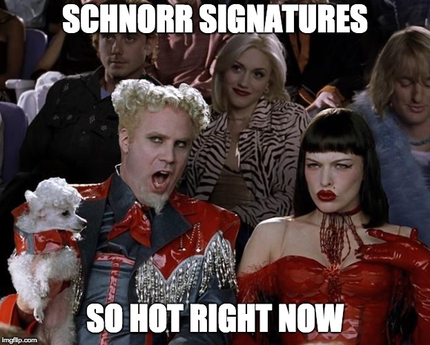

# Schnorr signatures

If you follow the crypto news, you'll know that that new hotness in Bitcoin is Schnorr Signatures.

But in actual fact, they're old news! The Schnorr signature is considered the simplest digital signature scheme 
to be provably secure in a random oracle model. It is efficient and generates short signatures. 
It was covered by U.S. Patent 4,995,082 which expired in February 2008 [WP1].

## So why all the fuss?

What makes Schnorr signatures so interesting (and [potentially dangerous](#key_cancellation_attack)) is their simplicity. 
Schnorr signatures are _linear_, so you have some nice properties.

Elliptic curves have the multiplicative property. So if you have two scalars _x, y_ with corresponding points, _X, Y_, 
the following holds:

\\[
  (x + y)G = xG + yG = X + Y 
\\]

Schnorr signatures are of the form \\( s = r + e.k \\). This construction is linear too, so it meshes nicely with
the linearity of elliptic curve math..
 
You saw this property in the previous section, when we were verifying the signature. Schnorr signatures' linearity 
makes it very attractive for things like

* signature aggregation
* atomic swaps
* 'scriptless' scripts

## (Naïve) Signature aggregation

Let's see how the linearity property of Schnorr signatures can be used to construct a 2-of-2 multi-signature.

Alice and Bob want to co-sign something (a Tari transaction, say) without having to trust each other; 
i.e. they need to be able to prove ownership of their respective keys, and the aggregate signature is
only valid if _both_ Alice and Bob provide their part of the signature. 

Assuming private keys are denoted \\( k_i \\) and public keys \\( P_i \\). If we ask Alice and Bob to each 
supply a nonce, we can try

\\[
\begin{align}
  P_{agg} &= P_a + P_b \\\\
  e &= H(R_a || R_b || P_a || P_b || m) \\\\
  s_{agg} &= r_a + r_b + (k_a + k_b)e \\\\
        &= (r_a + k_ae) + (r_b + k_ae) \\\\
        &= s_a + s_b
\end{align}
\\]

So it looks like Alice and Bob can supply their own _R_, and anyone can construct the 2-of-2 signature 
from the sum of the _R_s and public keys. This does work:

{{#playpen src/aggregation_1.rs}}

But this scheme is not secure!

## Key cancellation attack

Let's take the previous scenario again, but this time, Bob knows Alice's public key and nonce ahead of time, by
waiting until she reveals them. 

Now Bob lies, and says that his public key is \\( P_b' = P_b - P_a \\) and public nonce is \\( R_b' = R_b - R_a \\).

Note that Bob doesn't know the private keys for these faked values, but that doesn't matter.

Everyone assumes that \\(s_{agg} = R_a + R_b' + e(P_a + P_b') \\) as per the aggregation scheme.

But Bob can create this signature himself: 

\\[
\begin{align}
  s_{agg}G &= R_a + R_b' + e(P_a + P_b') \\\\
    &= R_a + (R_b - R_a) + e(P_a + P_b - P_a) \\\\
    &= R_b + eP_b \\\\
    &= r_bG + ek_bG \\\\
  \therefore s_{agg} &= r_b + ek_b = s_b
\end{align}
\\]

{{#playpen src/cancellation.rs}}

## Better approaches to aggregation

In the key attack above, Bob didn't know the private keys for his published _R_ and _P_ values. We could defeat Bob
by asking him to sign a message proving that he _does_ know the private keys.

This works, but it requires another round of messaging between parties, which is not conducive to great UX.

# MuSig

[MuSig](GM18) is another simple signature aggregation scheme that is secure and preserves the property that the aggreate
signature is still a valid Schnorr signature.

MuSig is an interactive scheme, meaning that an input message is required from all the signers. The scheme works as follows:

1. Each signer has a public-private key pair as before.
1. Each signer publishes the public key of their nonce, \\( R_i \\),
1. Everyone calculates the same "shared public key", _X_: 
\\[
    \begin{align}
        \ell &= H(X_1 || \dots || X_n) \\\\
        a_i &= H(\ell || X_i) \\\\
        X &= \sum a_i X_i \\\\
    \end{align}
\\]
Note that in the ordering of public keys above, some deterministic convention should be used, such as the lexicographical
order of the serialised keys.
1. as well as the shared nonce, \\( R = \sum R_i \\).
1. The challenge, _e_ is \\( H(R || X || m) \\)
1. Each signer provides their contribution to the signature as
\\[ 
    s_i = r_i + k_i a_i e
\\]
Notice that the only departure here from a standard Schnorr signature is the inclusion of the factor \\( a_i \\).
1. The aggregate signature is the usual summation, \\( s = \sum s_i \\).

Verification is done by confirming that 

\\[ 
  sG \equiv R + e X \\
\\]

as usual. Proof:

\\[ 
\begin{align}
  sG &= \sum s_i G \\\\
     &= \sum (r_i + k_i a_i e)G \\\\
     &= \sum r_iG + k_iG a_i e \\\\
     &= \sum R_i + X_i a_i e \\\\
     &= \sum R_i + e \sum a_i X_i \\\\
     &= R + e X \\\\
     \blacksquare
\end{align}
\\]

Let's demonstrate this using a three-of-three multisig:

{{#playpen src/musig.rs}}

[WP1]: https://en.wikipedia.org/wiki/Schnorr_signature 'Wikipedia:Schnorr signature'
[BS18]: https://blockstream.com/2018/01/23/musig-key-aggregation-schnorr-signatures.html 'Blockstream: Key Aggregation for Schnorr Signatures'
[GM18]: https://eprint.iacr.org/2018/068.pdf 'Maxwell et. al., Simple Schnorr Multi-Signatures with Applications to Bitcoin'